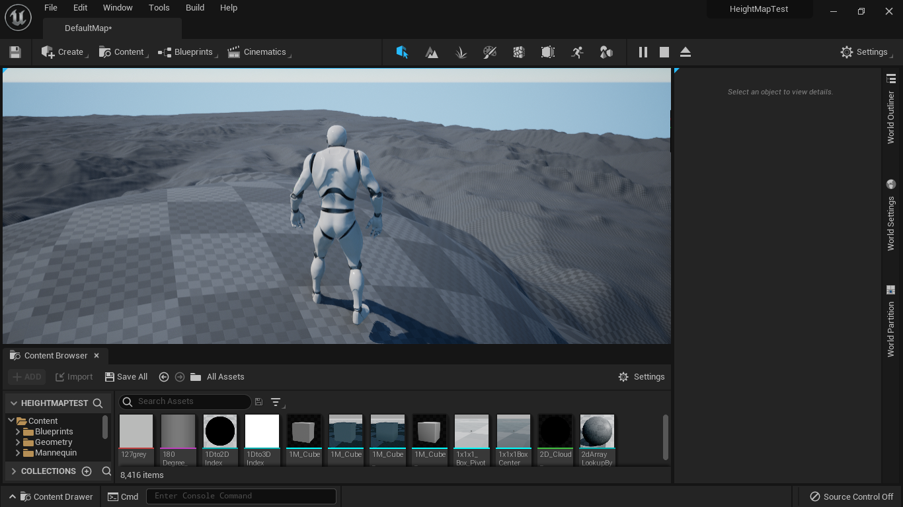
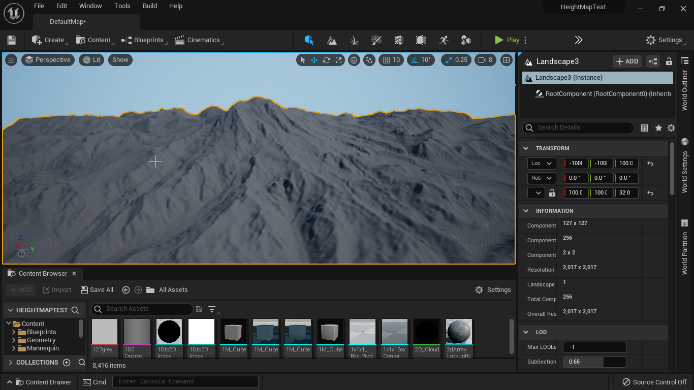

# Unreal Mapbox Bridge 

#### Use real world heightmap data from Mapbox and automatically convert it to an Unreal heightmap image

See it live [here](https://terrain.justgeektechs.com/)

## Install the dependencies
```bash
npm install
```

### Start the app in development mode (hot-code reloading, error reporting, etc.)
```bash
npm start
```
## Build
```bash
npm run build
```

## Setup

When you initially run the application you will have to set some data.

**Settings Tab**

1) Enter a mapbox access token under the Settings Tab in the Mapbox Access Token File field

    To get an access token you can create a free [mapbox account](https://www.mapbox.com/). Then goto your account page and copy the default access token or create a new one.

2) Choose a download directory from the Settings screen.

3) Click the Save Settings button

**Map Tab**

Click and hold to drag around the map

Type in a name or coordinates in the search box

Click on the tile sqaure you want to select. It will turn blue when selected.

You will see a preview of what the heightmap will look like as well as some statistics.

Click the download button to download the selected tile 16 bit heightmap file.

Select Terrain size is currently now working.  The image will download as 512x512.

The Scale number is also not correct. I would suggest an initial scale of 400 when you import into Unreal.

**Convert image to Unreal Landscape Size**

See Unreal Recommended Landscape Sizes [here](https://docs.unrealengine.com/4.27/en-US/BuildingWorlds/Landscape/TechnicalGuide/)

Programs you can use to resample your image to the landscape size you are using.

[GIMP](https://www.gimp.org/https://www.gimp.org/), [Affinity Photo](https://affinity.serif.com/en-us/photo/), [Photoshop](https://www.adobe.com/products/photoshop/landpa.html).
[Terra Sculptor](http://www.demenzunmedia.com/home/terresculptor/) -- is an awesome free program for creating and manipulating heightmap images.  It even has preset landscape sizes for Unreal.  To enable UDK go to Settings > Dimensions and check UDK Landscape.

The principle is the same for all. 

Example: **GIMP**

1) Choose File > Open then open the sixteen-x-x-x.png file for the tile you selected.  The numbers indicate the selected tile.

2) Choose Layer > Scale Layer
3) Type in the width and height (should be the same as in height: 2017 width: 2017)
4) Set the Interpolation to NoHalo and click Scale
5) Choose File > Export as and name your converted file.
6) On the popup dialog box namedExport image as PNG leave all defaults and click Export.


Import the heightmap into Unreal per normal procedure.  You will need to adjust the Z-scale try 400 to start and go up or down as needed.

Example imported landscape standing on top of Mt. Rainier






*Inspired by and some code used from this [project](https://github.com/colkassad/terrain-rgb-height).  A Big thanks to colkassad.*