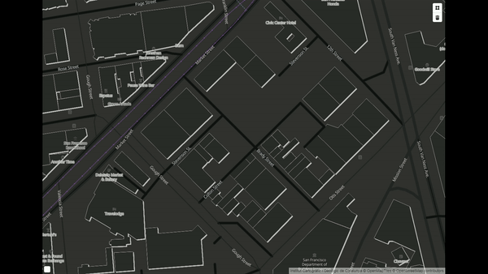

## Mapbox GL Draw Rectangle Assisted Mode
[](https://badge.fury.io/js/%40geostarters%2Fmapbox-gl-draw-rectangle-assisted-mode)

This is a custom mode for (Mapbox GL Draw) [https://github.com/mapbox/mapbox-gl-draw]  that adds the functionality to draw  assisted rectangles.




#### Changelog:

```bash
Version 3.0.4: Change to Mapbox GL js v1.6.0 and fix minor dependencies 
Version 3.0.3: Change to Mapbox GL js v1.4.0 
Version 3.0.2: Add custom draw rectangle style 
Version 3.0.1: Add orientation angle calculation
Version 3.0.0: Draw strict rentangle mode
```
Based on:

https://github.com/thegisdev/mapbox-gl-draw-rectangle-mode

https://github.com/mapbox/mapbox-gl-draw/blob/master/src/modes/draw_polygon.js


### Install

`npm install @geostarters/mapbox-gl-draw-rectangle-assisted-mode`

### Page Demo 

https://geostarters.github.io/mapbox-gl-draw-assisted-rectangle-mode/index.html

### Usage

```js
import DrawRectangle from 'mapbox-gl-draw-rectangle-assisted-mode';

        mapboxgl.accessToken = '';
        const map = new mapboxgl.Map({
            container: 'map',
            style: 'https://tilemaps.icgc.cat/tileserver/styles/water.json',
            center: [-122.419518, 37.772995],
            zoom: 17,
            hash: true
        });

        const modes = MapboxDraw.modes;
        modes.draw_assisted_rectangle = DrawAssistedRectangle.default;

        const draw = new MapboxDraw({
            modes: modes,
            displayControlsDefault: false,
            controls: {
                polygon: true,
                trash: true
            },
            userProperties: true,
            styles: STYLES_DRAW
        });
        map.addControl(draw);
        map.on('draw.create', function (feature) {
            console.log(feature);
        });
    
```


### Build

`npm build-web`  with browsify

`npm build-all`  with babel

### License

MIT

### Credits            

Developed by @ICGCAT

More Info
>[https://openicgc.github.io/](https://openicgc.github.io/)

>[https://github.com/geostarters](https://github.com/geostarters)

>[http://betaportal.icgc.cat/](http://betaportal.icgc.cat/)

>[http://www.icgc.cat/en/](http://www.icgc.cat/en/)


