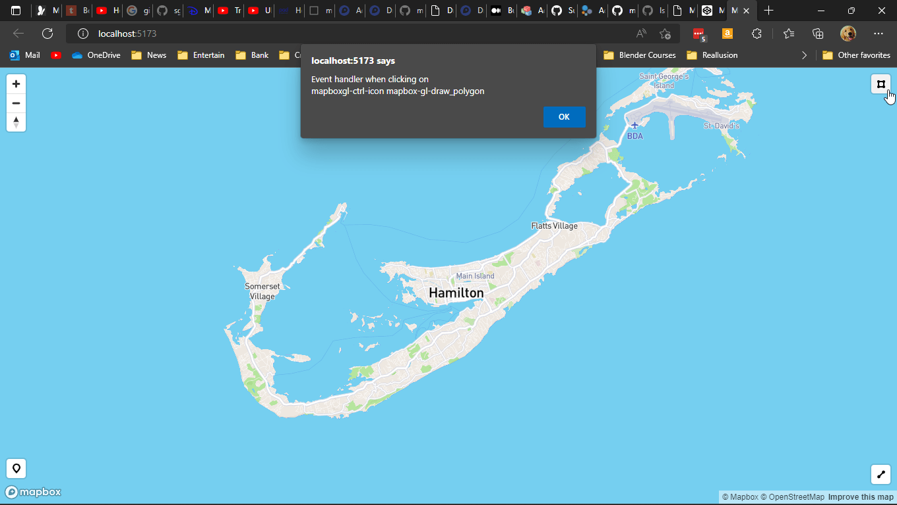

# mapbox-gl-button-control

add button or html element to Mapbox Control Bar

Npm module created from https://codepen.io/roblabs/pen/zJjPzX 

See Example folder

you will need to add your own mapbox access token for the demo in the index.js


```csharp
cd Example

npm install 

npm start
```


